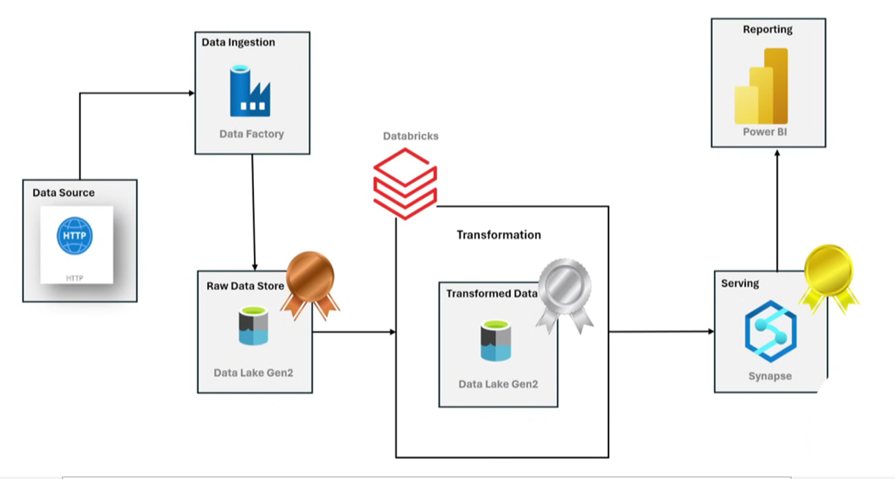

## azure-data-engineering-project
# Introduction
The AdventureWorks Data Engineering Project is a cloud-based data pipeline built on the Microsoft Azure ecosystem. It demonstrates how raw business data can be ingested, transformed, and modeled into analytical datasets using the medallion architecture approach (Bronze, Silver, Gold). This project showcases essential data engineering skills—including data ingestion with Azure Data Factory, transformation using PySpark in Azure Databricks, and modeling in Azure Synapse Analytics—making it ideal for real-world enterprise use cases

## Architecture

